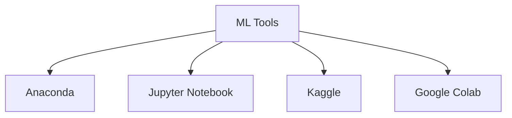

# Lecture 12

---

## ML Tools Overview Flowchart

## Tools Used for Machine Learning

### Anaconda

- Open-source distribution for Python and R.
- Simplifies package management and deployment.
- Includes tools like Jupyter Notebook, Spyder, and many ML/data science libraries.
- Useful for creating isolated environments for different projects.

### Jupyter Notebook

- Interactive web-based notebook environment.
- Allows writing and executing code in cells, mixing code with markdown/text.
- Supports visualization and step-by-step code execution.
- Widely used for prototyping, data analysis, and sharing code.

### Kaggle

- Online platform for data science competitions.
- Provides free datasets, kernels (notebooks), and a collaborative environment.
- Useful for practicing ML skills, sharing solutions, and learning from others.
- Offers cloud-based notebooks with GPU support.

### Google Colab

- Free cloud-based Jupyter notebook environment by Google.
- Supports Python and many ML libraries.
- Provides free access to GPUs and TPUs for faster computation.
- Enables easy sharing and collaboration.

## Summary

- These tools help streamline the ML workflow, from coding and visualization to collaboration and competition.
- Choice of tool depends on project requirements, hardware needs, and collaboration preferences.
