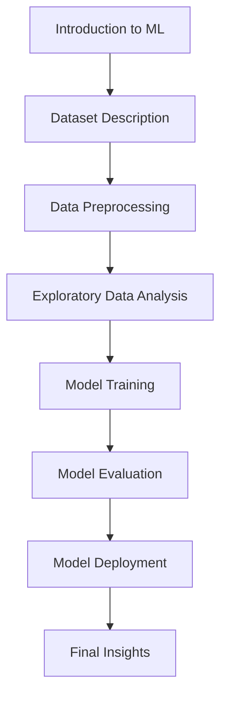

# Lecture 13

---

## Machine Learning Workflow with Toy Dataset

### Introduction to ML

- Overview of applying machine learning processes on a toy dataset.
- Focus on solving a classification problem.

### Dataset Description

- "Placement" dataset includes CGPA and placement status for students.
- Goal: Predict placements based on input data (CGPA, exam scores).

### Data Preprocessing

- Importance of preprocessing, handling missing values, and removing unnecessary columns.
- Initial examination of dataset shape and columns.

### Exploratory Data Analysis (EDA)

- Analyze data patterns through visualizations.
- Separate features (inputs) from target variables (output).

### Model Training

- Use Logistic Regression for classification.
- Explain the training process using datasets.

### Model Evaluation

- Visualize predictions and examine model performance.
- Use accuracy metrics and confusion matrix.

### Model Deployment

- Integrate the trained model into a web application.
- Enable real-time predictions based on user input.

### Final Insights

- Leverage the learned ML model for practical scenarios.
- Demonstrate effective implementation and usage.
