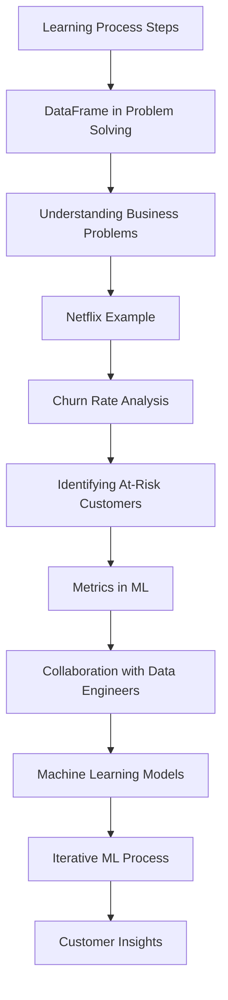

# Lecture 14

---

## ML Business Problem Workflow

## Key Concepts

### Learning Process Steps

- Importance of understanding and applying 19 key steps in machine learning.

### DataFrame in Problem Solving

- Data frames help handle data issues effectively in ML projects.

### Understanding Business Problems

- Convert business problems into ML problems for actionable solutions.

### Netflix Example

- Hypothetical meeting at Netflix about increasing revenue by improving user retention.

### Churn Rate Analysis

- Focus on reducing churn rate and retaining existing customers.

### Identifying At-Risk Customers

- Strategies to recognize customers likely to leave and mitigate potential loss.

### Metrics in Machine Learning

- Define success metrics to consistently evaluate model performance.

### Collaboration with Data Engineers

- Teamwork between data scientists and engineers ensures correct data for analysis.

### Machine Learning Models

- Discuss different problem types (regression, classification) and approaches.

### Iterative Process of Machine Learning

- ML model development is iterative, refining models based on data insights.

### Importance of Customer Insights

- Gather customer behavior and preferences to tailor services effectively.
