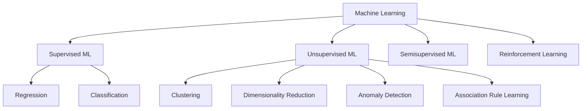

# Lecture 3

---

## Machine Learning Types Flowchart

## Types of Machine Learning

### Supervised ML

- i/p and o/p given from the dataset, helps in predicting further inputs and outputs.

- Types of Data:

  1. Numerical
  2. Categorical

- Types of Supervised ML
  1. Regression
  2. Classification

#### Regression

- Output/Target column has numerical data
  

#### Classification

- Output/Target column has categorical data
  

### Unsupervised ML

- Only i/p is given from the dataset which can be used to predict any metric based on the inputs.

- Types of Unsupervised ML
  1. Clustering
  2. Dimesionality Reduction
  3. Anamoly Detection
  4. Association Rule Learning

#### Clustering

- Inputs plotted on a graph to create clusters (groups) from the data.
  

#### Dimesionality Reduction

- Creates a new metric that joins multiple inputs into a single column to predict the output better.
- Advanced technique to perform visualizations.

#### Anamoly Detection

- Detects any outliers(basically out of the box) data points with respect to the dataset and remove them.
- Can be used in various sectors such as manufacturing, stock market etc.

#### Association

- Fetching data from a dataset and then drawing relations and conclusions according to it.

### Semisupervised ML

- Prediction of outputs which can be done by providing only a few inputs.
- Google Photos uses clustering for detecting people and adds all the photos in which those certain people appear.

### Reinforcement Learning

- Entire algorithm (agent) has no memory and data to start with.
- Learns and processes itself like humans.
- Self-driving cars have to observe its environment, rewards and updates itself with the results.
