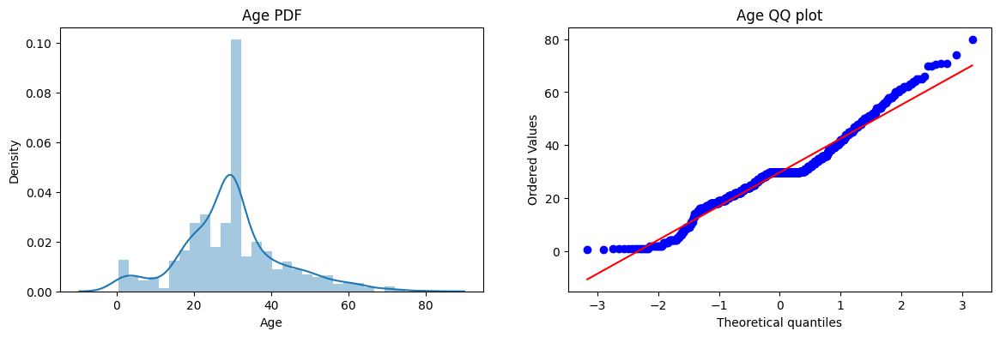
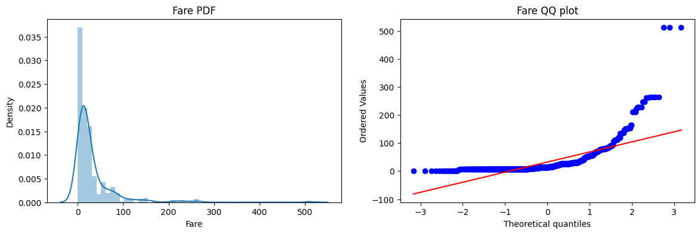

# Lecture 30

---

## Feature Transformations

- These are used to transform the features in a way that can improve the performance of machine learning models.
- End goal is to reach the normal distribution of the features, or at least get closer to it, as many machine learning algorithms perform better when the features are normally distributed.
- We can find out if the data is normally distributed by using the `skew` method from pandas, which measures the skewness of the distribution. Also `sns.distplot` can be used to visualize the distribution of the data.
- QQ Plots are the most reliable way to check for normality, as they compare the quantiles of the data to the quantiles of a normal distribution.





### Types of Feature Transformations

- **Function Transformer:** This allows us to apply any custom function to the features. For example, we can use a logarithmic transformation to reduce the skewness of the data.

#### Log Transformation

- This is a common transformation used to reduce the skewness of the data. It can be applied using the `FunctionTransformer` from scikit-learn.
- Cannot be applied on negative values.
- Right-skewed data is the best candidate for log transformation.
- It will scale the graph linearly, so the values will be more spread out and closer to a normal distribution.

```python
from sklearn.preprocessing import FunctionTransformer
log_transformer = FunctionTransformer(np.log1p)
X_log = log_transformer.fit_transform(X)
```

#### Reciprocal Transformation

- All small values will be transformed to large values and all large values will be transformed to small values.

```python
reciprocal_transformer = FunctionTransformer(lambda x: 1 / (x + 1e-10))
X_reciprocal = reciprocal_transformer.fit_transform(X)
```

#### Square Transformation

- Mostly used for left-skewed data, as it can help to reduce the skewness and make the distribution more normal.

```python
square_transformer = FunctionTransformer(np.square)
X_square = square_transformer.fit_transform(X)
```

#### Square Root Transformation

- This is another common transformation used to reduce the skewness of the data. It can be applied using the `FunctionTransformer` from scikit-learn.
- It is less aggressive than the log transformation and can be applied to data that contains zero or negative values.

```python
sqrt_transformer = FunctionTransformer(np.sqrt)
X_sqrt = sqrt_transformer.fit_transform(X)
```