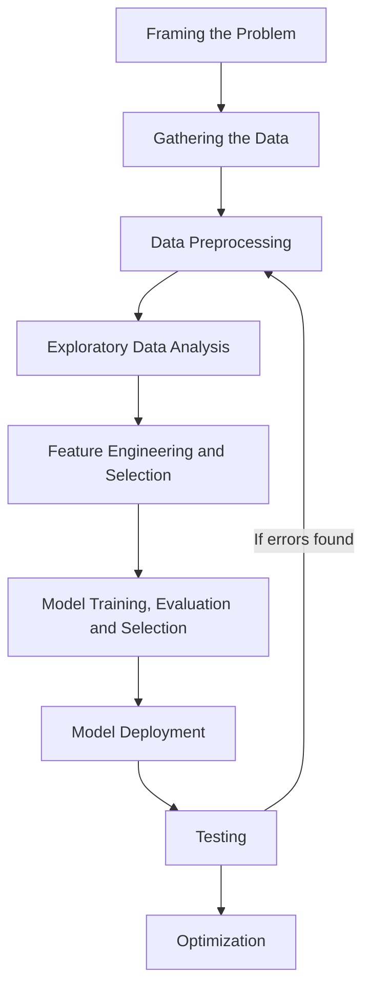

# Lecture 9

---

## ML Development Life Cycle

- Main objective is to develop a software product which uses ML

### Framing the Problem

- Knowing the problem correctly.
- Divide it in a step-by-step manner.
- Planning the entire solution by identifying the problem.

### Gathering the Data

- Data collection is limited and not easily available in companies.
- Need to use APIs or even perform Web Scraping to get data.

### Data Preprocessing

- Data needs to be cleaned, formatted and preprocessed properly.
- ML models won't be able to run efficiently with unorganized data.

### Exploratory Data Analysis

- Creating a relationship between inputs and outputs.
- Extracting them and then forming visualisations.
- Analyzing multiple tables/columns.

### Feature Engineering and Selection

- Creating new columns or combining multiple inputs for a better metric for calculating outputs.
- Not all features are helpful and can hamper the progress of the workflow, so those are removed.

### Model Training, Evaluation and Selection

- Bringing all the models together to check the calculations and the outputs.
- Based on given parameters, a single model is evaluated and selected for better outcomes.
- Model settings are tuned for high performance requirements.
- High, powerful model is created.

### Model Deployment

- ML Models are now deployed on a server.
- It will now serve user requests on an online platform (website, app etc.).

### Testing

- Beta testing is done of the model.
- This is only done in front of a few users that will provide feedback to improve the working of the model.
- Any error detection will lead to the model undergoing the entire process from which the error has arised.

### Optimization

- Taking the backups of model and datasets to have a sense of security.
- Load balancing is done to manage crowd traffic on the model.
- Deciding when to retrain the model, on what frequency.
- Trying to perfect the entire process.
